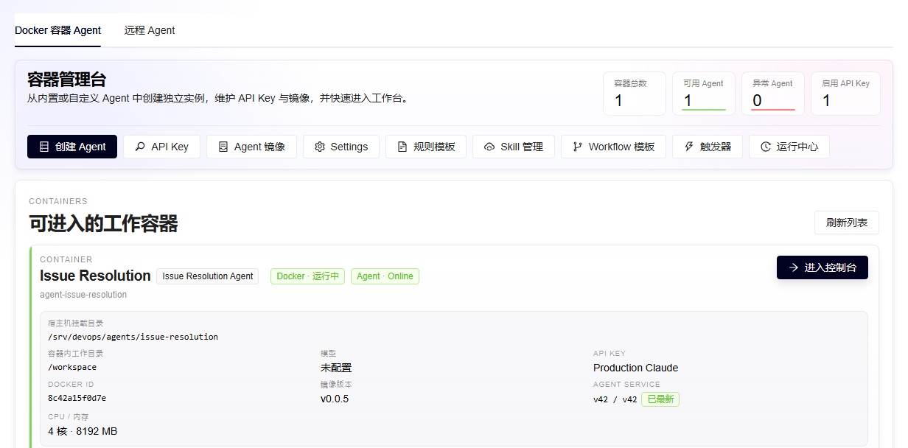
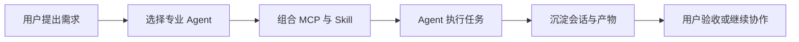

<p align="center">
  
</p>

<h1 align="center">Agents Platform</h1>

<p align="center">
  <strong>把企业 AI 从一次对话，变成可交付、可运营的生产能力。</strong>
</p>

<p align="center">
  内置专业 Agent、MCP、Skill、Workflow、Issue 和客户授权，<br />
  用一套平台持续创建、交付和治理真正参与业务的数字员工。
</p>

<p align="center">
  <a href="https://github.com/xiaoxiao113213/agents-platform/releases/latest"></a>
  
  
  
  
</p>

<p align="center">
  <a href="https://mmmqaz.cn/"><strong>官方网站</strong></a>
  ·
  <a href="https://mmmqaz.cn/#/deploy">部署指南</a>
  ·
  <a href="https://mmmqaz.cn/#/guide">使用指南</a>
  ·
  <a href="https://mmmqaz.cn/#/releases">版本与下载</a>
</p>

<p align="center">
  <a href="https://github.com/xiaoxiao113213/agents-platform/releases/download/v0.0.6/devops-v0.0.6-linux-x64.tar.gz"><strong>下载 v0.0.6</strong></a>
  ·
  <a href="https://github.com/xiaoxiao113213/agents-platform/releases/tag/v0.0.6">版本说明</a>
</p>

> Agents Platform 正式版本统一由 [GitHub Releases](https://github.com/xiaoxiao113213/agents-platform/releases) 以 Linux 安装包交付。包名中的 `devops` 是现有发行标识，产品名称仍为 Agents Platform。

## 为什么需要 Agents Platform

企业真正需要的不是再多一个聊天框，而是能够进入业务、受到权限约束、留下过程证据并持续升级的 Agent 系统。

| 常见的单体 Agent 项目 | Agents Platform |
| --- | --- |
| 通常需要自行安装工具、沉淀提示词 | 专业 Agent、MCP 与 Skill 目录直接选择 |
| 多业务环境需要额外维护配置映射 | MCP 可按项目多次添加并自定义 Server 名称 |
| 执行证据往往分散在聊天与工作目录 | 会话、任务、产物、容器状态和 Issue 统一留痕 |
| 团队权限需要另行集成 | Agent 与 Issue 原生支持按客户、用户和组授权 |
| 版本与现场配置保护需要自行建设 | 版本冻结、累计升级，并保护真实配置与 Nginx 修改 |

| `5` 个专业 Agent | `17+` 个内置 MCP | `2` 种运行形态 | `1` 套累计升级链路 |
| ---: | ---: | ---: | ---: |
| 开箱即用的工程能力 | 接入数据库、监控与研发流程 | Docker Agent + 远程 Agent | 新装与跨版本升级使用同一正式包 |

## 平台工作台



从镜像选择、API Key、MCP 和 Skill，到运行状态、任务产物、客户授权与异常诊断，管理员都可以在同一个工作台完成。后台管理端与客户工作台使用独立入口和端口，客户只能访问已授权的 Agent 与 Issue 项目。

## 内置专业 Agent

| Agent | 面向场景 | 交付能力 |
| --- | --- | --- |
| 通用开发 Agent | 研发、分析、文档与自动化 | 持久化工作区、工具调用、任务产物和完整会话 |
| AI 视频制作 Agent | 教学、产品介绍与知识传播 | 脚本、分镜、神经语音旁白、Remotion 渲染和成片验收 |
| AI PPT Agent | 汇报、方案与培训材料 | 内容结构、页面设计、图表素材和可编辑演示文稿 |
| Grafana Dashboard Agent | 监控体系与运营大盘 | 连接 MySQL/Grafana，生成查询、面板与完整 Dashboard |
| Issue Resolution Agent | 需求、Bug 与研发任务处理 | 按优先级串行领取、下载上下文、澄清、处理并交回人工验收 |

内置 Agent 使用固定版本镜像和受管工程规范。必填连接信息不提供虚假的演示默认值，密码与 Token 由服务端加密保存；同一种 Agent 可以按团队或项目创建多个独立实例。实际使用时仍需提供有效的模型 API Key，以及目标业务所需的 MySQL、Grafana、Issue 项目或其他第三方凭据；视频 Agent 的在线语音生成还需要访问对应语音服务。

## 从需求到验收



Issue 场景形成了更严格的人机闭环：待 AI 处理的 Issue 按优先级降序、创建时间正序进入队列；Agent 一次只领取一条。信息不足时主动评论并转为待用户澄清，处理完成后转为 AI 处理完毕，最终关闭权始终留给用户。

## 核心能力

- **Agent 工程化**：每种专业能力都有独立镜像、默认工程、质量规范、工具链和验收方式。
- **MCP 目录**：内置 MySQL、Grafana、Docker、Kubernetes、Jenkins、GitHub、GitLab、SonarQube、Kafka、S3、DevOps Issue 等 JavaScript MCP 制品；同一 MCP 可以连接多个项目或客户环境。
- **运行时治理**：区分容器生命周期与 Agent 执行状态，支持错误诊断、API Key 切换、上下文压缩和任务产物管理。
- **团队协作**：按客户、用户和组授权 Agent 与 Issue，共享会话和处理记录，同时隔离未授权资源。
- **Issue 闭环**：父子 Issue、类型、优先级、状态流转、评论、附件、项目令牌、MCP 与标准 Skill 形成完整链路。
- **可持续交付**：每个正式版本同时支持空库安装和累计升级，现场 `application.properties` 与 `nginx/devops.conf` 不被覆盖。

## 快速部署

最新正式版本为 **v0.0.6**，生产环境仅支持 Linux x64。

第一次部署或不熟悉 Linux/Nginx 时，请严格按[官方部署指南](https://mmmqaz.cn/#/deploy)操作。当前正式版 `v0.0.6` 尚不包含交互式 `install` 命令，需要按指南完成环境、数据库、配置和 Nginx 接入；当前 `master` 的 `v0.0.7` 开发版已实现交互安装向导，待正式发布后官网会自动切换为一键流程。部署后的 API Key、Agent、MCP、Skill、授权与 Issue 操作见[使用指南](https://mmmqaz.cn/#/guide)。

部署前准备：

- Java 21 或更高版本
- MySQL 8，并创建空的 `devops` 数据库
- Docker Engine 与 Docker CLI，服务运行账号具备操作 Docker 的权限
- 部署服务器能够访问发布清单中的镜像仓库；私有仓库需提前完成 `docker login`
- Nginx，用于提供后台与客户工作台并代理 API、SSE 和 WebSocket

如需接入远程 Agent，目标机还要安装 Node.js 24+ 和当前用户可执行的 Claude CLI。创建 Agent 前需在后台配置可用的模型 API Key；Grafana、数据库和 Issue 等能力按实际项目填写对应凭据。

```bash
curl -fL \
  -o devops-v0.0.6-linux-x64.tar.gz \
  https://github.com/xiaoxiao113213/agents-platform/releases/download/v0.0.6/devops-v0.0.6-linux-x64.tar.gz

tar -xzf devops-v0.0.6-linux-x64.tar.gz
cd devops-v0.0.6

# v0.0.6 按中文注释填写 MySQL、工作目录、SECRET_KEY 等必填配置
vi application.properties

# 修改平台站点文件，再接入 Nginx 已启用的 http include 目录
vi nginx/devops.conf
sudo nginx -t
sudo systemctl reload nginx

./devops.sh check
./devops.sh start
./devops.sh status
```

`check` 始终只读，会检查 Linux/CPU、Java、MySQL、Docker、远端镜像、Nginx、配置权限和端口归属，并针对失败项给出中文修复指引。首次启动由 Flyway 自动初始化数据库，后续版本自动执行累计迁移。`v0.0.7` 发布后，交互向导会在每项确认后自动处理这些步骤，并保持不覆盖系统 `nginx.conf`、不停止未知进程的安全边界。

首次初始化会创建后台管理员 `admin`，初始密码为 `111111`。只允许先从受控管理网络登录，并立即在“个人信息 → 修改密码”中更换客户专用强密码；完成改密前不要开放公网入口。后台与客户工作台的访问地址以 `nginx/devops.conf` 中两个独立站点的 `server_name` 和 `listen` 为准。

> 首次部署编辑并启用的是实际文件 `nginx/devops.conf`；`nginx/devops.conf.example` 是当前版本模板，仅用于后续升级时对比和合并新增路由。完整配置、升级和回滚说明随发布包提供。

## 版本与升级策略

- 新客户直接安装接入时的最新正式版本，不需要补装历史版本。
- 老客户可以从任意更早正式版本累计直升，逐版升级不是前置条件；`v0.0.5` 及更早客户首次切换到远程镜像交付时，使用新包内的 `upgrade-from-offline-release.sh`，后续版本再使用标准 `devops.sh upgrade`。
- 正式升级前先备份 MySQL、`application.properties` 和 `nginx/devops.conf`，再执行只读的 `upgrade --check`。
- Tag、Release、版本说明、Flyway 迁移和发布归档一经正式发布即冻结，不覆盖历史记录。
- Agent 镜像使用与正式版本匹配的固定 tag；部署脚本按清单自动 `docker pull`，发布包不再携带数 GiB 镜像归档。

查看全部版本：[GitHub Releases](https://github.com/xiaoxiao113213/agents-platform/releases)

---

<p align="center">
  <strong>Agents Platform</strong><br />
  让 Agent 真正进入业务，并对每一次执行结果负责。
</p>
